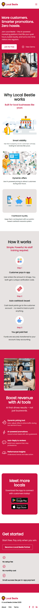

# Local Bestie Landing Page
 
 
 
 

## Table Of Contents 

- [Tech Stack](#tech-stack)
- [Introduction of the Webpage](#introduction-of-the-webpage)
- [UI Preview](#ui-preview)
- [How to Run](#how-to-run)


## Tech Stack
- Next.js 
- TypeScript
- Tailwind CSS

## Introduction of the Webpage
This is the landing page for **Local Bestie (Merchant)**. It showcases the core features of the platform’s AI-powered tools, designed to help merchants attract and retain local customers.

## UI Preview

Desktop preview: 


Mobile preview:



## How To Run

Before running the project, make sure you have the following installed:

- [Visual Studio Code](https://code.visualstudio.com/)
- [Node.js (LTS version)](https://nodejs.org/)
- npm (comes with Node.js)

### Steps:

**1. Open VS Code and clone the repository**

- Open Visual Studio Code

- Open the Terminal (from the top menu: Terminal > New Terminal)

- Run the following command in the terminal:
```
git clone https://github.com/lesley-gao/local-bestie-merchant-landing.git
```

**2. Navigate into the project directory**
```
cd local-bestie-merchant-landing
```

**3. Install dependencies**

```
npm install
```

**4. Start the development server**

```
npm run dev
```

**5. Open in browser**

Once the server starts, open your browser and go to:
```
http://localhost:3000
```

Or, you can watch the demo video ([Click the link](https://youtu.be/GkCzEjyS0DA)) here.
